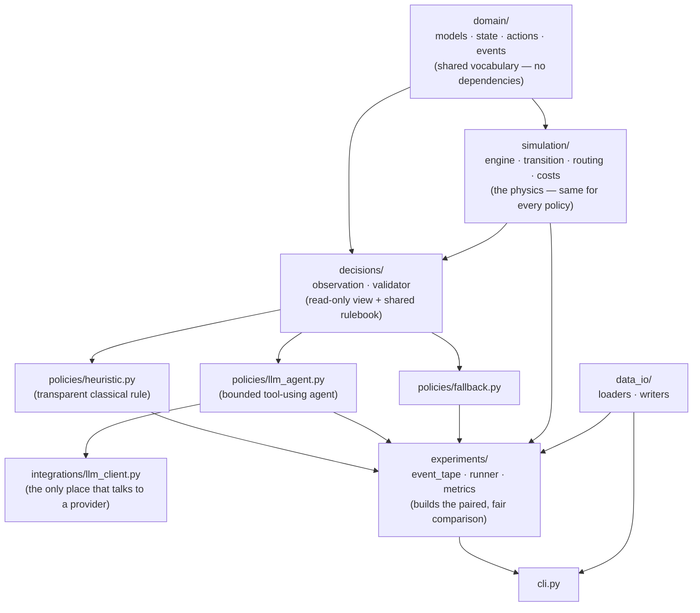
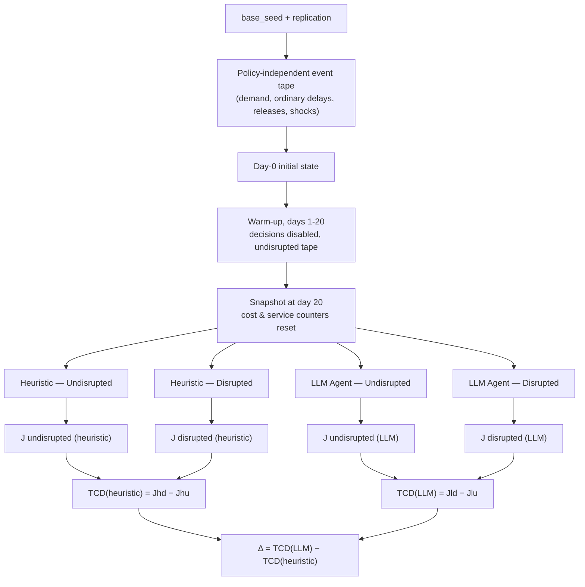

# Supply-Chain Agent Evaluation

## The idea

This project is my attempt to build a small, deterministic, fully-instrumented supply-chain simulator, then run a classical heuristic and a bounded LLM agent through **exactly** the same disruptions, the same information, the same action space, and the same cost accounting — and see what actually happens.

## Research question

> Under identical disrupted supply-chain conditions and operational constraints, can a bounded LLM-enabled policy produce valid shipment-level decisions that reduce the incremental cost of disruption more effectively and robustly than a classical heuristic?

## Philosophy

A few principles I am holding myself to throughout this build:

- **The comparison is the product, not the LLM's score.** This project succeeds if it produces a fair, executable, auditable, reproducible comparison — regardless of which policy wins. A result that favors the heuristic is just as publishable as one that favors the LLM.
- **Simplicity first.** The smallest correct implementation beats a clever one. No speculative abstractions, no frameworks, no code written for a Version 2 that doesn't exist yet.
- **Fairness is non-negotiable.** Both policies start from identical cloned states, see the same disruption information at the same time, choose from the same four actions, and are scored by the same shared cost model. Nothing about the simulation physics may know which policy is currently deciding.
- **Determinism where it matters.** All demand, ordinary transport delay, and disruption timing is pre-generated into a policy-independent event tape before either policy runs. Given the same state, the same validated actions, and the same event tape, the simulator must produce the same result — every time.
- **Evidence over claims.** Every run is fully traced: proposed actions, validation results, fallback use, and executed actions are logged separately, so any result can be reconstructed and audited after the fact.

## Version 1 scope

### What it is

Version 1 is a discrete-time, single-product, transportation-and-inventory simulator. It models:

- a directed logistics network of suppliers, ports, hubs, and one manufacturing plant;
- shipments released on a fixed replenishment schedule;
- inventory and stochastic daily demand at the plant;
- ordinary transport delays and a designed, temporary network disruption (a port closure);
- shipment-level decisions — `WAIT`, `REROUTE`, `EXPEDITE`, `ABSTAIN`;
- a shared cost model covering transport, rerouting, expediting, holding, backlog, and lateness;
- paired disrupted vs. undisrupted runs, replicated many times under different random seeds.

### What it deliberately is not

Version 1 does **not** attempt supplier selection, procurement, production planning, multiple products, shipment splitting, partial expediting, joint optimization across shipments, reinforcement learning, or real-time/distributed execution. It is not a web application and it does not use a database. These constraints keep the action space small enough that both policies can be judged on a level playing field. The full non-goal list is in `CLAUDE.md`.

## How it works

Every simulation day follows the same fixed sequence, run by shared code that never branches on which policy is deciding:

1. Reveal any newly-known disruption and apply its physical effects to the operational network.
2. Process shipment arrivals, release scheduled shipments, realize demand, and fulfil backlog/demand from inventory.
3. Build a read-only `DecisionObservation` for every shipment that actually needs a decision (blocked route, at-risk due date, repeated capacity waits, etc.).
4. Ask the active policy — heuristic or LLM — for an action per observation.
5. Validate every proposed action against the shared rules; invalid or abstained actions fall through to a configured fallback.
6. Apply validated route changes, allocate departures under node/edge capacity, and charge the day's transport, holding, and backlog costs.

For each scenario and replication, I generate **one** event tape (demand, ordinary delays, shipment releases, disruption) before any policy runs. I then clone the post-warm-up state into four branches — heuristic/undisrupted, heuristic/disrupted, LLM/undisrupted, LLM/disrupted — and run all four against that same tape. The primary outcome is the paired difference in incremental disruption cost:

```
TCD(policy) = J(disrupted) − J(undisrupted)        # cost attributable to the disruption, per policy
Δ           = TCD(LLM) − TCD(heuristic)             # the paired comparison
```

`Δ < 0` means the LLM handled the disruption more cheaply for that replication; `Δ > 0` means the heuristic did. The headline result is the *distribution* of `Δ` across many replications — mean, median, confidence interval, win rate, worst case — not a single run.

## System architecture

The codebase is a small modular monolith. Dependencies only ever point one way, so the simulation physics can never know a policy exists, and a policy can never touch simulation state directly.



*Arrows show "depends on, flows into." A policy never mutates state directly — it receives an immutable `DecisionObservation` and returns a structured action, which the shared validator accepts or rejects before anything is executed.*

The paired-experiment procedure itself — the part that actually produces the research result — looks like this:



All four branches in a replication start from deep clones of the *same* warmed-up snapshot and consume the *same* event tape, differing only in which policy decides and whether the designed disruption is active.

## Repository structure

```text
supply-chain-agent-evaluation/
├── CLAUDE.md                     # the build contract — formal model, schemas, acceptance criteria
├── README.md                     # this file
├── pyproject.toml
├── .env.example
├── configs/
│   ├── networks/baseline_network.yaml
│   ├── scenarios/port_closure.yaml
│   ├── policies/heuristic.yaml
│   ├── policies/llm_agent.yaml
│   └── experiments/baseline_comparison.yaml
├── outputs/                      # generated run artifacts (git-ignored, except .gitkeep)
├── src/supply_chain_simulator/
│   ├── domain/                   # entities, state, actions, exogenous events
│   ├── simulation/                # engine, transition, routing, costs
│   ├── decisions/                 # observation builder, shared validator
│   ├── policies/                  # heuristic, LLM agent, fallback
│   ├── experiments/               # event tape, paired runner, metrics
│   ├── integrations/              # LLM provider client
│   ├── data_io/                   # config loading, result writing
│   └── cli.py
└── tests/
    ├── unit/
    ├── integration/
    └── fixtures/
```

## Getting started

### Requirements

- Python `>= 3.12, < 3.14`
- An OpenAI API key, only if you intend to run the LLM policy live (not required for the heuristic policy, for tests, or for replaying a previously recorded LLM trace)

### Installation

```bash
python -m venv .venv
source .venv/bin/activate
pip install -e ".[dev]"
```

Runtime dependencies are deliberately minimal: `networkx` (route enumeration), `pydantic` (strict config validation), `PyYAML` (config loading), `openai` (live LLM calls). Everything else — CSV/JSON output, hashing, randomness, statistics — uses the standard library.

### Environment variables

```bash
cp .env.example .env
```

Fill in:

```text
OPENAI_API_KEY=
LLM_MODEL=
```

Never commit `.env`. Only `.env.example` (with empty values) is tracked.

## Configuration

Every run is assembled from four YAML files under `configs/`:

| File | Defines |
|---|---|
| `networks/baseline_network.yaml` | the logistics network, product, initial inventory, replenishment plan, demand process, action costs |
| `scenarios/port_closure.yaml` | the designed disruption (target, timing, severity) |
| `policies/heuristic.yaml` | the classical policy's parameters |
| `policies/llm_agent.yaml` | the LLM policy's provider, tool limits, fallback, live/replay mode |
| `experiments/baseline_comparison.yaml` | combines all of the above with the horizon, warm-up, drain period, seed, and replication count |

Configuration is intentionally boring: strict schemas, no silent coercion, no unknown fields accepted, no scientific parameter overridable from the command line. If you want to change a horizon or a seed, you edit the file — so every run stays fully self-describing from its saved, resolved configuration.

### Validating configuration

```bash
python -m supply_chain_simulator.cli validate-config \
  --config configs/experiments/baseline_comparison.yaml
```

### Running the baseline experiment

```bash
python -m supply_chain_simulator.cli run \
  --config configs/experiments/baseline_comparison.yaml
```

This runs the configured number of replications of the baseline port-closure scenario, each producing four branches (heuristic/LLM × undisrupted/disrupted), and writes a complete, timestamped output directory.

## Output files

Each run writes to `outputs/<experiment_id>__<UTC_TIMESTAMP>/`:

```text
manifest.json           # provenance: git commit, dependency versions, config/prompt hashes
resolved_config.yaml    # the exact configuration used, secrets redacted
event_tapes.jsonl        # the policy-independent randomness for every replication
run_metrics.csv          # one row per branch: costs, service level, decision validity
daily_metrics.csv        # day-by-day trajectory for every branch
decision_traces.jsonl    # every proposed, validated, fallback, and executed action
llm_interactions.jsonl   # full LLM tool-call traces (no secrets, no hidden reasoning)
replications.csv         # per-replication TCD and Δ
summary.json             # aggregate statistics: mean/median Δ, confidence interval, win rates
```

Nothing is aggregated silently — a failed replication fails the experiment rather than being dropped from the average.

## Reproducibility and the limits of live LLM calls

The simulation itself is fully deterministic: given the same configuration, seed, and event tape, the heuristic policy — and any policy replayed from a recorded trace — produces byte-identical results. The event tape (demand, ordinary delays, disruption timing) is generated once per replication, before any policy runs, and shared unchanged across all four branches.

A **live** LLM call is a different matter. Even at temperature `0.0`, provider-side execution is not guaranteed to be bit-for-bit reproducible run to run. I do not claim exact reproducibility for live LLM decisions. What I do guarantee instead:

- every live interaction (prompt, tool calls, tool outputs, submitted action, token usage, latency) is recorded in full;
- a recorded trace can be **replayed** deterministically, without calling the provider again, to reproduce that exact policy run;
- a live provider failure fails the experiment outright — it is never silently papered over by falling back to the heuristic, since that would quietly change which policy is actually being scored.

## Testing and quality gates

```bash
python -m pytest                 # full suite — no live API calls are made in tests
python -m pytest tests/unit      # unit tests: transitions, routing, costs, validation, heuristic
python -m pytest tests/integration
ruff check .
mypy src
```

Minimum coverage is 90%, with branch coverage enabled — though passing coverage is not the goal in itself; the tests that matter are the ones with manually-checked expected values (a tiny fixed network, hand-calculated costs and shipment positions) and the ones that prove the paired-experiment invariants hold: identical initial states, tapes that differ only by the designed disruption, and symmetric observations for both policies.

## Project status

Version 1 is being built in sequence, from the ground up, each stage checked before the next begins:

```text
0. Repository bootstrap        5. Observation, actions, validator
1. Domain model + config       6. Heuristic policy
2. Event tape                  7. Experiment runner + outputs
3. Routing + cost model        8. LLM integration
4. Core simulation loop        9. Baseline end-to-end experiment
```

## Author

Yassine ERRAJI, under the supervision of Guillaume LECUÉ.
