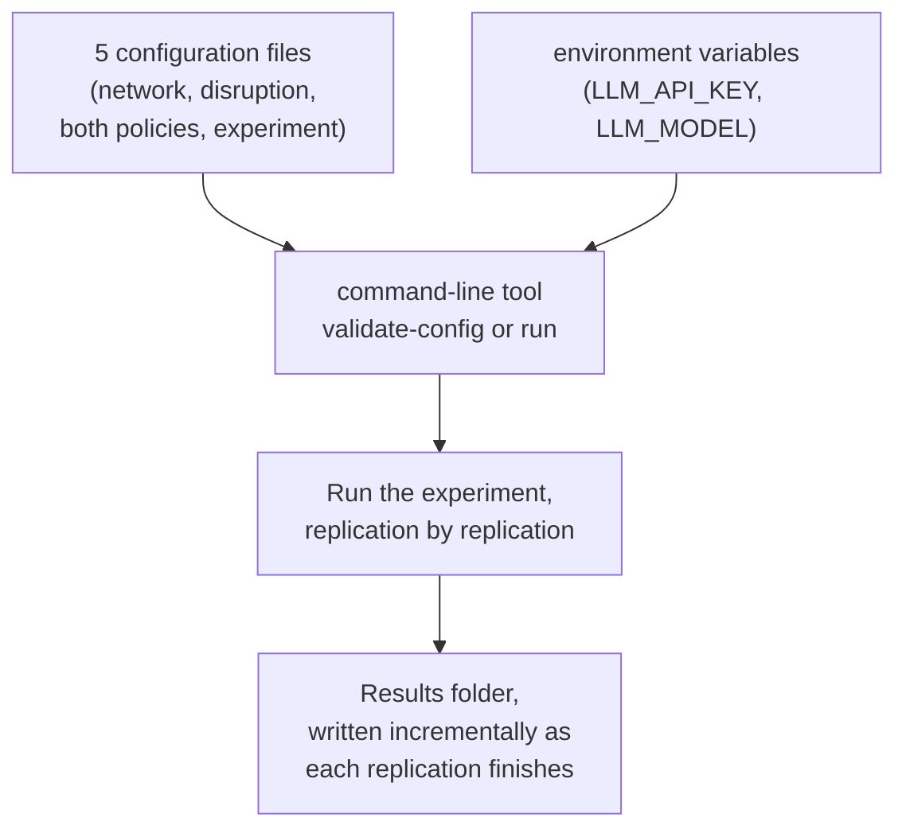
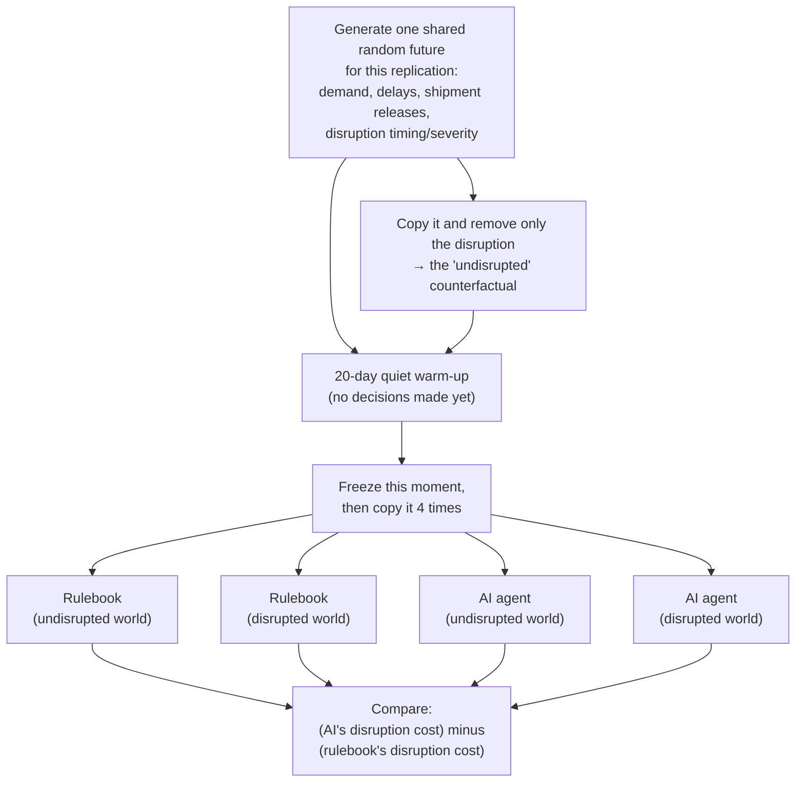
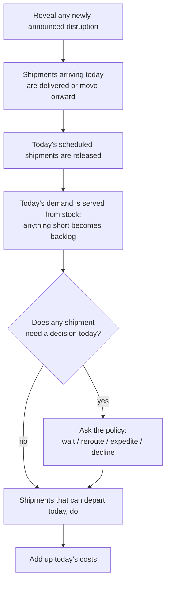
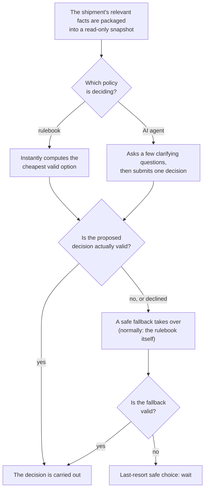
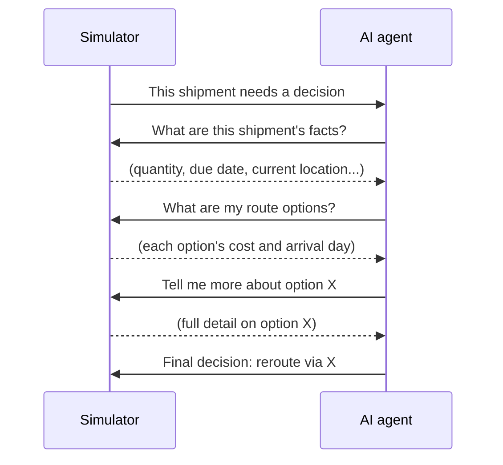

# Evaluating Agentic AI for Supply-Chain Disruption Mitigation

A research simulator that answers one question:

> **When a supply chain gets disrupted, does a bounded AI agent make cheaper, better decisions than a simple hand-written rulebook — and does that answer depend on how the network is built or how bad the disruption is?**

It does this by building a small, realistic (but simplified) supply chain, breaking it in a controlled and repeatable way, and letting two different decision-makers — a classical rule-based policy and a real AI agent — respond to the exact same disruption under the exact same conditions, so their results can be compared fairly.

The project has run in two stages. **Version 1** tested this on one fixed network under three disruption severities. **Version 2** extended it to three differently-shaped networks crossed with those same three severities, after auditing V1's results turned up a real methodological gap worth fixing first. Both stages share the exact same simulator, fairness rules, and comparison logic — V2 only changes *what varies between trials*, never *how the comparison itself works*.

---

## Contents

- [What this is, in plain terms](#what-this-is-in-plain-terms)
- [What this covers, V1 and V2](#what-this-covers-v1-and-v2)
- [What was found](#what-was-found)
- [How it works](#how-it-works)
- [Project layout](#project-layout)
- [Getting started](#getting-started)
- [Configuring a run](#configuring-a-run)
- [Validating a configuration](#validating-a-configuration)
- [Running an experiment](#running-an-experiment)
- [Understanding the output](#understanding-the-output)
- [Generating plots and reports](#generating-plots-and-reports)
- [A note on AI reproducibility](#a-note-on-ai-reproducibility)
- [Running the tests](#running-the-tests)
- [Using the webapp](#using-the-webapp)
- [Where to learn more](#where-to-learn-more)

---

## What this is, in plain terms

Imagine a toy supply chain: a supplier, a couple of ports and a hub, and a factory that needs a steady stream of parts every day. One day, the main port shuts down for a while — trucks and ships can't move through it. Shipments already on their way, and every new one released while it's closed, now need a decision: wait it out, take a longer detour, or pay extra for a rush shipment?

Two different decision-makers are asked to handle this, one at a time:

- **The rulebook** — a small, transparent, deterministic set of rules: it looks at the available options and picks whichever one is cheapest, with clear tie-breaking rules.
- **The AI agent** — a real large language model (an LLM, via the OpenAI API) that is shown the same facts, allowed to ask a handful of clarifying questions, and must submit one final decision.

Both are held to the exact same rules about what counts as a valid decision. Neither can invent a route that doesn't exist, skip a broken node, or make up numbers. If either one proposes something invalid — or the AI declines to answer — a safe fallback takes over automatically, and that's recorded too.

To make the comparison fair, the simulator also runs a second, disruption-free version of the *same* world (same demand, same random delays, same shipment schedule — just no disruption) for each decision-maker. The real cost of the disruption for each one is *(cost with the disruption) − (cost without it)*. Whichever policy's disruption cost is lower "wins" that round. This whole thing is repeated many times with different random conditions ("replications") to see if the result holds up consistently, not just once by luck.

## What this covers, V1 and V2

**Both versions do:**
- Simulate one product moving through a directed network of suppliers, ports, one or more hubs, and a factory, day by day.
- Generate realistic daily demand, ordinary transport delays, and a recurring stream of shipments.
- Apply a designed disruption (a port or hub closure/slowdown) in a controlled, repeatable way.
- Let a shipment-level decision be made only when something actually needs deciding (a blocked route, a shipment running late, one stuck waiting too long, etc.) — one of: **wait**, **take a different (normal) route**, **pay for a rush/emergency route**, or **decline to decide**.
- Compare the classical rulebook against a real, tool-using AI agent under identical, fair conditions, across many repeated trials.

**V1** did this on one fixed 5-node network, with the disruption's timing, duration, and disclosure fixed in advance and every shipment exactly the same size. **V2** adds three things on top, without changing anything about how a decision is made or scored: **(1)** two more network shapes — a smaller one with no detour option at all, and a much larger, more redundant one — tested alongside the original; **(2)** the disruption's start day, how long it lasts, and how late it's disclosed are now randomized per trial instead of fixed; **(3)** shipment size is randomized too (on the two new networks — the original stays exactly as it was, on purpose, so it remains a like-for-like comparison to V1's own numbers).

**Neither version (yet):**
- Handles more than one product, multiple demand destinations, or supplier/procurement choices.
- Lets either policy create shipments, change demand, or modify the network itself.
- Models more than one disruption *type* changing mid-run, or lets a policy split a shipment.
- Uses a database or any real-time/production deployment — this is a research tool, run from the command line, that reads configuration files and writes result files. (A separate, optional `webapp/` — see [Using the webapp](#using-the-webapp) — adds a browsable, explorable front end over the same `outputs/` and CLI; it is not part of the research pipeline itself.)

## What was found

**V1**, run for real (100 trials per severity, 300 total, against the live API): the AI agent lost under a mild disruption but won decisively under a full port closure and a severe closure — a clean-looking pattern. But every single trial in every severity agreed with every other trial exactly (100%/0% every time), which is a red flag: it means the experiment's randomness was too weak to ever produce a close call, not that the effect was genuinely that overwhelming.

**V2** was built specifically to fix that, and then run for real too (498 trials across all nine network-shape × severity combinations, live). The result: the original network and the smaller one reproduce V1's pattern (AI agent loses on a mild disruption, wins big on a severe one) — but **the larger, more redundant network flips it entirely**: the rulebook wins there, and wins by *more* as the disruption gets worse, the opposite direction. One combination (the small network under a moderate disruption) even produced a genuine mixed result — the AI agent won about three-quarters of the time rather than every time or never — the first non-unanimous outcome either version has produced.

**In short: whether the AI agent helps depends on both how bad the disruption is and how much flexibility the network has to route around it.** It is not a universal win or a universal loss. The full numbers, caveats, and a discussion of what this does and doesn't prove are in [`reports/finalReport.pdf`](reports/finalReport.pdf) — see [Where to learn more](#where-to-learn-more).

## How it works

Nothing runs at the same time as anything else — every step happens one after another, which keeps every result exactly reproducible (with one caveat for the live AI, [explained below](#a-note-on-ai-reproducibility)). This is unchanged between V1 and V2. The system breaks down into five pieces, shown one at a time below.

### 1. The overall pipeline

Every run starts from configuration files and environment variables, and ends with a results folder.



### 2. One replication, step by step

A "replication" is one independent, repeated trial. Each one builds a fair, paired comparison from scratch:



### 3. Inside one simulated day

Each of the four runs above plays out one day at a time, always in this order:



### 4. How one decision gets made

Whenever a shipment does need a decision, both policies go through the exact same gate — nothing either one proposes is trusted blindly:



### 5. The AI agent's conversation

When it's the AI agent's turn, it doesn't just get told the answer — it has a short, bounded conversation with the simulator before committing to one decision:



It's capped at a handful of questions per decision, and it can only ask about — never change — the facts it's given.

Every configuration file is a plain text file, so every run is fully described and reproducible just by keeping the files that produced it — there are no hidden command-line switches for anything that affects the science.

## Project layout

```
configs/        the 5 kinds of configuration files (see below)
src/            the actual program
tests/          the automated test suite
analysis/       plot_results.py — turns a results folder (or several) into charts
outputs/        results land here, one timestamped folder per experiment run
reports/        the write-ups: slide decks and the LaTeX/PDF reports (see below)
webapp/         optional, separate: a browsable front end over outputs/ and the CLI — see below
data/           (currently unused placeholder)
```

You will only ever need to touch files under `configs/` and the `.env` file described below — everything under `src/` is the program itself. `analysis/`, `reports/`, and `webapp/` are all downstream of the simulator's output files, not part of the simulation logic.

## Getting started

### Requirements

- Python 3.12 or 3.13.
- An OpenAI API key with some available credit, if you intend to run the AI agent live (validating configuration, and running with the classical rulebook alone, cost nothing).

### Installation

From the project root, in a terminal:

```bash
python3.12 -m venv .venv
source .venv/bin/activate        # on Windows: .venv\Scripts\activate
pip install -e ".[dev]"
```

This creates an isolated Python environment for the project (a "virtual environment") and installs everything it needs, including the tools used for testing. Add `.[analysis]` instead of (or alongside) `.[dev]` if you also want to generate plots — see [Generating plots and reports](#generating-plots-and-reports).

### Environment setup

The AI agent needs an OpenAI API key. This is kept out of every configuration file and out of every result file — it only ever lives in one local, git-ignored file:

```bash
cp .env.example .env
```

Then open `.env` in a text editor and fill in the two values:

```
OPENAI_API_KEY=sk-...your-real-key...
LLM_MODEL=gpt-5.4-mini
```

`.env` is listed in `.gitignore` and will never be committed. Never paste a real key into any file under `configs/`.

## Configuring a run

An experiment is assembled from five small YAML files (YAML is a plain, readable text format for configuration):

| File | What it defines |
|---|---|
| `configs/networks/*.yaml` | The map: locations, transport lanes, their capacity/cost/speed/reliability, starting inventory, how demand behaves, and the recurring shipment schedule. Three shapes exist: `baseline_network.yaml` (V1's original, 5 nodes), `topology_compact.yaml` (4 nodes, no detour route), and `topology_extended.yaml` (10 nodes, several detour routes). |
| `configs/scenarios/*.yaml` | The disruption: what breaks, roughly when it starts and ends, and roughly when the policies are told about it — as of V2, these are ranges a real value is drawn from per trial, not fixed values. |
| `configs/policies/heuristic.yaml` | The two tuning numbers for the classical rulebook. |
| `configs/policies/llm_agent.yaml` | Which AI model to use, how many questions it may ask per decision, timeouts, retries, and what happens if it fails to answer. |
| `configs/experiments/*.yaml` | Ties everything together: which network/scenario/policies to use, how many days to simulate, how many replications to run, the random seed, and which result files to write. |

The original V1 experiment is `configs/experiments/baseline_comparison.yaml`. V2 adds nine more — every combination of the three network shapes above with three disruption severities (e.g. `compact_light_comparison.yaml`, `extended_heavy_comparison.yaml`) — each one just a config file, run the same way as the original. You generally shouldn't need to write a new one from scratch: copy the closest existing file and adjust what you need (for example, a smaller `replications` number for a quick, cheap trial run — most experiment files also have a matching `*_calibration.yaml`/`*_smoke.yaml` sibling pre-set to run only a handful of replications for exactly this purpose).

## Validating a configuration

Before spending any time or money, check that a configuration is well-formed:

```bash
python -m supply_chain_simulator.cli validate-config --config configs/experiments/baseline_comparison.yaml
```

This loads and cross-checks every referenced file and prints either a confirmation or a specific, readable error — nothing is simulated and no AI call is made.

## Running an experiment

```bash
python -m supply_chain_simulator.cli run --config configs/experiments/baseline_comparison.yaml
```

**This makes real calls to the OpenAI API and spends real money whenever the configured policy is set to `execution_mode: LIVE`.** In practice this has cost roughly $0.05–0.06 per replication at full length; a 100-replication file therefore costs a few dollars and can take a couple of hours, and the largest of the nine V2 grid files (the biggest network under the worst disruption) took the longest of all nine in the real run that produced this project's results. If you just want to see the tool work end to end cheaply first, use one of the `*_calibration.yaml` files (3 replications) or copy an experiment file and reduce `replications` yourself.

Progress prints to the screen as each replication finishes, along with which policy "won" that round. At the end, a summary (average cost difference, how often each policy won, etc.) is printed and also saved to disk.

## Understanding the output

Each run creates one new folder under `outputs/`, named `<experiment_id>__<timestamp>`, containing:

| File | Contents |
|---|---|
| `manifest.json` | A fingerprint of the run: versions, git commit, configuration hashes, which AI model was used. Never contains the API key. |
| `resolved_config.yaml` | The complete, final configuration actually used (with any secret values redacted). |
| `run.log` | Detailed execution log for troubleshooting. |
| `event_tapes.jsonl` | The exact random "future" (demand, delays, shipment releases, the realized disruption) generated for each replication. |
| `run_metrics.csv` | One row per policy/scenario branch per replication: total cost and its breakdown, service-quality numbers, decision statistics. |
| `daily_metrics.csv` | The same, broken down day by day. |
| `decision_traces.jsonl` | Every single decision either policy was asked to make, what it proposed, whether it was valid, and what actually happened. |
| `llm_interactions.jsonl` | Every real conversation with the AI: what it asked, what it was told, what it decided, and how many tokens/how long it took. |
| `replications.csv` | One row per replication: both policies' costs and the final comparison. |
| `summary.json` | The final aggregate numbers for the whole experiment. |

`.jsonl` files are "JSON Lines" — one independent JSON record per line, so they can be read a line at a time even for a very large run.

## Generating plots and reports

`analysis/plot_results.py` turns one or more `outputs/` folders into charts — it never touches simulation logic, only reads already-written result files. Requires the optional `analysis` dependency group: `pip install -e ".[analysis]"`.

For a single experiment:

```bash
python analysis/plot_results.py \
  --experiment outputs/baseline_comparison__2026...Z \
  --label "Standard x Medium" \
  --output-dir analysis/plots
```

This writes cost/delta/tail-risk/behavior charts for that one run. Give it two or more `--experiment`/`--label` pairs and it adds a cross-scenario comparison chart too.

For the full nine-cell grid, use `--cell TOPOLOGY SEVERITY PATH` (repeatable, one per cell you have results for — the grid doesn't need to be complete):

```bash
python analysis/plot_results.py \
  --cell Compact  Light  outputs/compact_light_comparison__2026...Z \
  --cell Standard Medium outputs/baseline_comparison__2026...Z \
  --cell Extended Heavy  outputs/extended_heavy_comparison__2026...Z \
  --output-dir analysis/plots
```

This additionally writes a heatmap, a win-rate heatmap, a topology-vs-severity interaction chart, and two diagnostic charts confirming the randomness is behaving as configured, into `<output-dir>/grid/`.

The write-ups built from this project's own real results — two narrated slide decks and two LaTeX/PDF reports (a V2-only one, and a combined V1+V2 one) — already exist under [`reports/`](reports/); see [Where to learn more](#where-to-learn-more).

## A note on AI reproducibility

Every part of this simulator is exactly reproducible for a given configuration and random seed — run it twice, get byte-for-byte identical numbers — **except for live AI decisions**. Even with the model's most deterministic setting, the same question can occasionally get a slightly different real answer the second time you ask it. This is expected and unavoidable when calling a real external model, not a bug in the simulator.

To get an *exact* re-run of a specific past experiment (including its AI decisions), switch the LLM policy's `execution_mode` to `REPLAY` and point `replay_trace_path` at a previously recorded `llm_interactions.jsonl` file — this reproduces the recorded decisions with no network call and no cost.

## Running the tests

```bash
pytest                                    # full automated test suite
pytest --cov=supply_chain_simulator       # with a coverage report
ruff check src tests                      # style/lint checks
mypy                                      # type checks
```

None of the automated tests call the real OpenAI API — the AI-related tests use a fully local, scripted stand-in, so the test suite costs nothing and never depends on network access.

## Using the webapp

`webapp/` (FastAPI backend + React/Vite frontend) is a separate, optional front end over the same `outputs/` directories and the same CLI this README describes — it reads and shells out, it never touches simulation logic directly, and it carries none of the scientific-validity obligations the sections above do (see `CLAUDE.md`'s own carve-out for this folder). It has four parts:

- **About** — the research question, the network/shock/action-space model, and the paired-branch fairness mechanism, in plain terms.
- **Findings** — the audited result itself, computed live from whatever's actually in `outputs/`: the V1 severity-flip story, the full V2 topology x severity grid as a heatmap, and the signal-to-noise check confirming the V2 redesign fixed the flaw its own audit found. Nothing here is a hardcoded number.
- **Results Gallery** — every completed experiment, browsable as a list or as the same grid heatmap: cost breakdown, network/disruption replay, and every shipment-level decision either policy made — including the LLM agent's actual tool-call reasoning trace, not just its final action.
- **Run Your Own** — launches a real, live comparison against the OpenAI API. Pick one of the nine real topology x severity presets (the exact validated `configs/` files), tune the disruption's timing/uncertainty and a handful of policy parameters, and submit with your own API key and model name. Capped replications keep runtime and cost bounded; you are billed directly by OpenAI for your own run.

### Launching it

Two servers, in two terminals, from the project root:

```bash
# terminal 1 — backend
cd webapp/backend
source .venv/bin/activate    # webapp/backend has its own venv, separate from the simulator's
uvicorn app.main:app --port 8000

# terminal 2 — frontend
cd webapp/frontend
npm install                  # first time only
npm run dev
```

Open the URL Vite prints (normally `http://localhost:5173`) — it proxies `/api` to the backend on port 8000 automatically, so both need to be running. The Findings and Results Gallery pages will immediately show whatever real experiments already exist under `outputs/`; Run Your Own works from the same page without any extra setup, using whichever OpenAI key and model you type in at submission time.

## Where to learn more

This README covers how to run the tool. For the underlying science:

| Document | What it's for |
|---|---|
| [`CLAUDE.md`](CLAUDE.md) | The full build contract: every design decision, invariant, and file responsibility for both V1 (frozen) and V2, at the level of detail needed to safely extend the system. The authoritative reference. |
| [`reports/v1_slide_deck.html`](reports/v1_slide_deck.html) | A narrated walkthrough of V1: why it's built the way it is, and its original results. Open directly in a browser. |
| [`reports/v2_slide_deck.html`](reports/v2_slide_deck.html) | A narrated walkthrough of V2: the audit that motivated it, what changed, and the full nine-cell grid results. Open directly in a browser. |
| [`reports/report_V2.pdf`](reports/report_V2.pdf) | A short, academic-style write-up of V2 alone (research problem, related work, methodology, results, limitations). |
| [`reports/finalReport.pdf`](reports/finalReport.pdf) | The same style, covering the *whole* study — V1 and V2 together as one two-phase research program. Start here if you only read one document. |

For a browsable UI over all of this — the findings, the results gallery, and a live run launcher — see [Using the webapp](#using-the-webapp) above.
