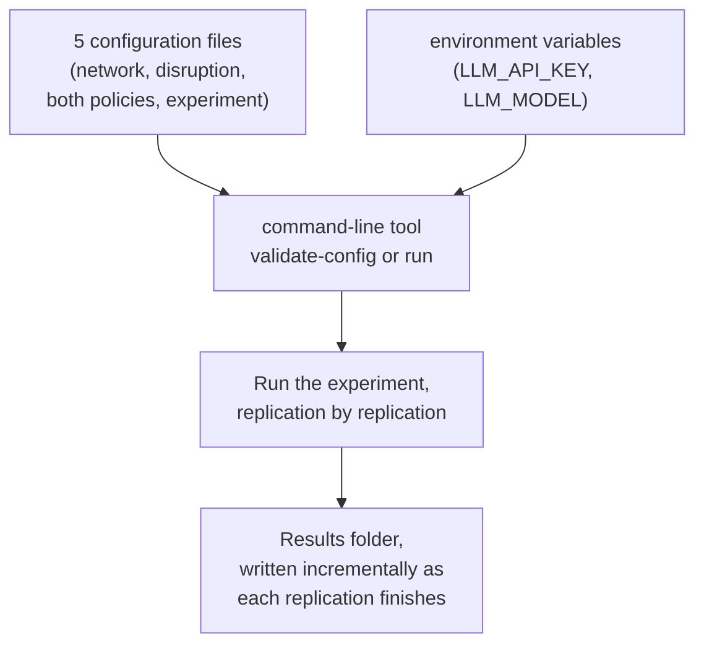
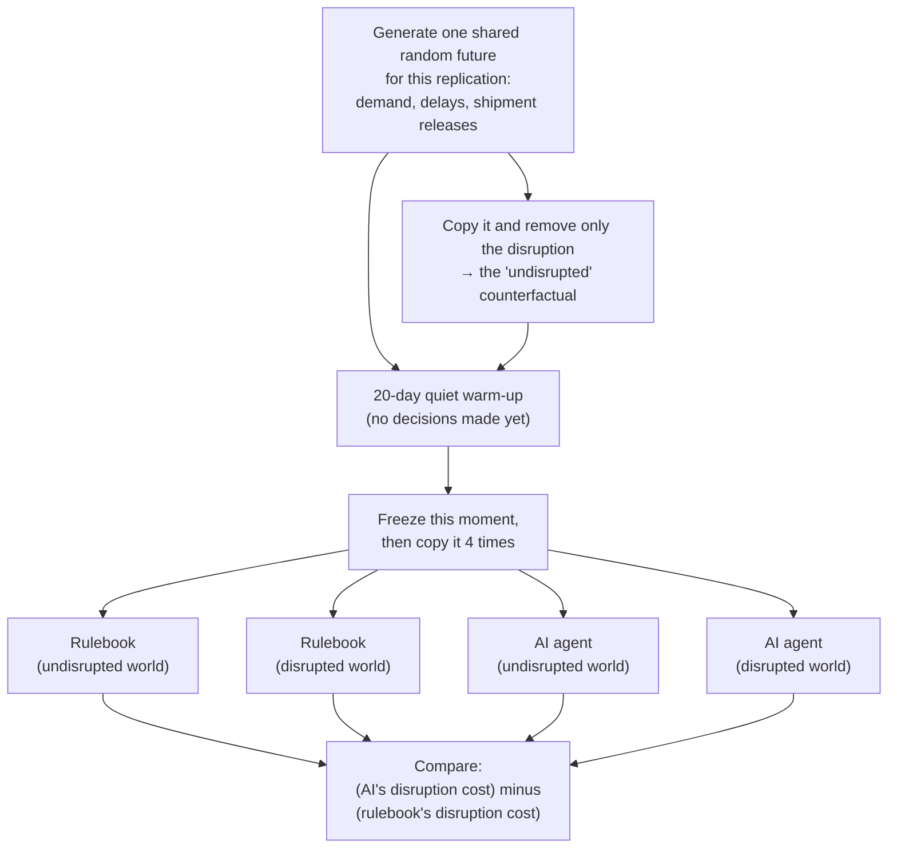
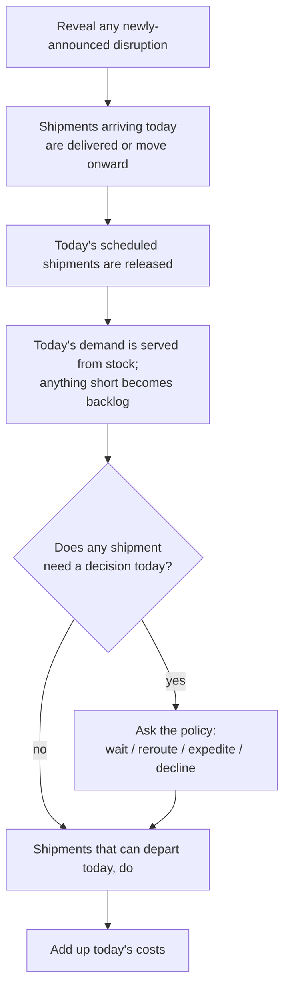
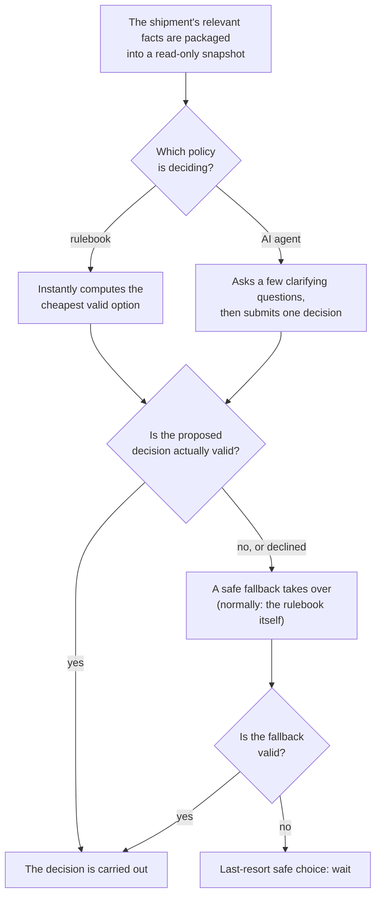
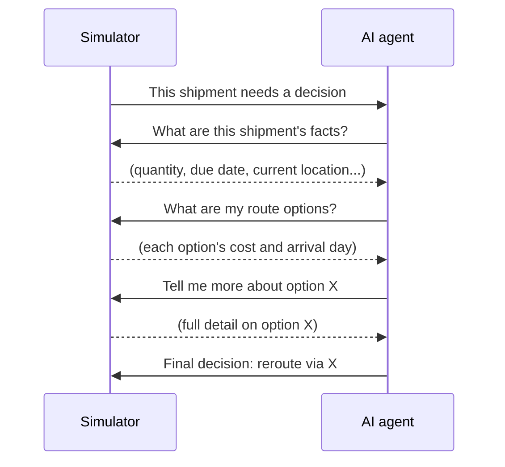

# Supply-Chain Agent Evaluation

A research simulator that answers one question:

> **When a supply chain gets disrupted, does a bounded AI agent make cheaper, better decisions than a simple hand-written rulebook?**

It does this by building a small, realistic (but simplified) supply chain, breaking it in a controlled and repeatable way, and letting two different decision-makers — a classical rule-based policy and a real AI agent — respond to the exact same disruption under the exact same conditions, so their results can be compared fairly.

---

## Contents

- [What this is, in plain terms](#what-this-is-in-plain-terms)
- [What Version 1 does and does not cover](#what-version-1-does-and-does-not-cover)
- [How it works](#how-it-works)
- [Project layout](#project-layout)
- [Getting started](#getting-started)
- [Configuring a run](#configuring-a-run)
- [Validating a configuration](#validating-a-configuration)
- [Running an experiment](#running-an-experiment)
- [Understanding the output](#understanding-the-output)
- [A note on AI reproducibility](#a-note-on-ai-reproducibility)
- [Running the tests](#running-the-tests)
- [Where to learn more](#where-to-learn-more)

---

## What this is, in plain terms

Imagine a toy supply chain: a supplier, a couple of ports and a hub, and a factory that needs a steady stream of parts every day. One day, the main port shuts down for a week — trucks and ships can't move through it. Shipments already on their way, and every new one released while it's closed, now need a decision: wait it out, take a longer detour, or pay extra for a rush shipment?

Two different decision-makers are asked to handle this, one at a time:

- **The rulebook** — a small, transparent, deterministic set of rules: it looks at the available options and picks whichever one is cheapest, with clear tie-breaking rules.
- **The AI agent** — a real large language model (an LLM, via the OpenAI API) that is shown the same facts, allowed to ask a handful of clarifying questions, and must submit one final decision.

Both are held to the exact same rules about what counts as a valid decision. Neither can invent a route that doesn't exist, skip a broken node, or make up numbers. If either one proposes something invalid — or the AI declines to answer — a safe fallback takes over automatically, and that's recorded too.

To make the comparison fair, the simulator also runs a second, disruption-free version of the *same* world (same demand, same random delays, same shipment schedule — just no port closure) for each decision-maker. The real cost of the disruption for each one is *(cost with the disruption) − (cost without it)*. Whichever policy's disruption cost is lower "wins" that round. This whole thing is repeated many times with different random conditions ("replications") to see if the result holds up consistently, not just once by luck.

## What Version 1 does and does not cover

**It does:**
- Simulate one product moving through a small directed network of suppliers, ports, a hub, and a factory, day by day.
- Generate realistic daily demand, ordinary transport delays, and a scheduled stream of shipments.
- Apply one designed disruption (a temporary port closure) in a controlled, repeatable way.
- Let a shipment-level decision be made only when something actually needs deciding (a blocked route, a shipment running late, one stuck waiting too long, etc.) — one of: **wait**, **take a different (normal) route**, **pay for a rush/emergency route**, or **decline to decide**.
- Compare the classical rulebook against a real, tool-using AI agent under identical, fair conditions, across many repeated trials.

**It deliberately does not (yet):**
- Handle more than one product, multiple demand destinations, or supplier/procurement choices.
- Let either policy create shipments, change demand, or modify the network itself.
- Model more than one disruption at a time, uncertain disruption duration, or delayed/partial information about a disruption.
- Use a database, a web interface, or any real-time/production deployment — this is a research tool, run from the command line, that reads configuration files and writes result files.

## How it works

Nothing runs at the same time as anything else — every step happens one after another, which keeps every result exactly reproducible (with one caveat for the live AI, [explained below](#a-note-on-ai-reproducibility)). The system breaks down into five pieces, shown one at a time below.

### 1. The overall pipeline

Every run starts from configuration files and environment variables, and ends with a results folder.



### 2. One replication, step by step

A "replication" is one independent, repeated trial — the baseline experiment runs 100 of these. Each one builds a fair, paired comparison from scratch:



### 3. Inside one simulated day

Each of the four runs above plays out one day at a time, always in this order:



### 4. How one decision gets made

Whenever a shipment does need a decision, both policies go through the exact same gate — nothing either one proposes is trusted blindly:



### 5. The AI agent's conversation

When it's the AI agent's turn, it doesn't just get told the answer — it has a short, bounded conversation with the simulator before committing to one decision:



It's capped at a handful of questions per decision, and it can only ask about — never change — the facts it's given.

Every configuration file is a plain text file, so every run is fully described and reproducible just by keeping the files that produced it — there are no hidden command-line switches for anything that affects the science.

## Project layout

```
configs/        the 5 kinds of configuration files (see below)
src/            the actual program
tests/          the automated test suite
outputs/        results land here, one timestamped folder per experiment run
data/           (currently unused placeholder)
```

You will only ever need to touch files under `configs/` and the `.env` file described below — everything under `src/` is the program itself.

## Getting started

### Requirements

- Python 3.12 or 3.13.
- An OpenAI API key with some available credit, if you intend to run the AI agent live (validating configuration, and running with the classical rulebook alone, cost nothing).

### Installation

From the project root, in a terminal:

```bash
python3.12 -m venv .venv
source .venv/bin/activate        # on Windows: .venv\Scripts\activate
pip install -e ".[dev]"
```

This creates an isolated Python environment for the project (a "virtual environment") and installs everything it needs, including the tools used for testing.

### Environment setup

The AI agent needs an OpenAI API key. This is kept out of every configuration file and out of every result file — it only ever lives in one local, git-ignored file:

```bash
cp .env.example .env
```

Then open `.env` in a text editor and fill in the two values:

```
OPENAI_API_KEY=sk-...your-real-key...
LLM_MODEL=gpt-5.4-mini
```

`.env` is listed in `.gitignore` and will never be committed. Never paste a real key into any file under `configs/`.

## Configuring a run

An experiment is assembled from five small YAML files (YAML is a plain, readable text format for configuration):

| File | What it defines |
|---|---|
| `configs/networks/*.yaml` | The map: locations, transport lanes, their capacity/cost/speed/reliability, starting inventory, how demand behaves, and the recurring shipment schedule. |
| `configs/scenarios/*.yaml` | The disruption: what breaks, when it starts and ends, and when the policies are told about it. |
| `configs/policies/heuristic.yaml` | The two tuning numbers for the classical rulebook. |
| `configs/policies/llm_agent.yaml` | Which AI model to use, how many questions it may ask per decision, timeouts, retries, and what happens if it fails to answer. |
| `configs/experiments/*.yaml` | Ties everything together: which network/scenario/policies to use, how many days to simulate, how many replications to run, the random seed, and which result files to write. |

The ready-to-use baseline experiment is `configs/experiments/baseline_comparison.yaml`. You generally shouldn't need to write a new one from scratch — copy it and adjust what you need (for example, a smaller `replications` number for a quick, cheap trial run).

## Validating a configuration

Before spending any time or money, check that a configuration is well-formed:

```bash
python -m supply_chain_simulator.cli validate-config --config configs/experiments/baseline_comparison.yaml
```

This loads and cross-checks every referenced file and prints either a confirmation or a specific, readable error — nothing is simulated and no AI call is made.

## Running an experiment

```bash
python -m supply_chain_simulator.cli run --config configs/experiments/baseline_comparison.yaml
```

**This makes real calls to the OpenAI API and spends real money whenever the configured policy is set to `execution_mode: LIVE`.** The baseline configuration runs 100 independent replications across a 60+ day simulated horizon; expect this to take a while and to cost a small but real amount. If you just want to see the tool work end to end cheaply first, copy the baseline experiment file, reduce `replications` (e.g. to 2) and `horizon_days`/`drain_days`, and point `--config` at your copy instead.

Progress prints to the screen as each replication finishes, along with which policy "won" that round. At the end, a summary (average cost difference, how often each policy won, etc.) is printed and also saved to disk.

## Understanding the output

Each run creates one new folder under `outputs/`, named `<experiment_id>__<timestamp>`, containing:

| File | Contents |
|---|---|
| `manifest.json` | A fingerprint of the run: versions, git commit, configuration hashes, which AI model was used. Never contains the API key. |
| `resolved_config.yaml` | The complete, final configuration actually used (with any secret values redacted). |
| `run.log` | Detailed execution log for troubleshooting. |
| `event_tapes.jsonl` | The exact random "future" (demand, delays, shipment releases, disruption) generated for each replication. |
| `run_metrics.csv` | One row per policy/scenario branch per replication: total cost and its breakdown, service-quality numbers, decision statistics. |
| `daily_metrics.csv` | The same, broken down day by day. |
| `decision_traces.jsonl` | Every single decision either policy was asked to make, what it proposed, whether it was valid, and what actually happened. |
| `llm_interactions.jsonl` | Every real conversation with the AI: what it asked, what it was told, what it decided, and how many tokens/how long it took. |
| `replications.csv` | One row per replication: both policies' costs and the final comparison. |
| `summary.json` | The final aggregate numbers for the whole experiment. |

`.jsonl` files are "JSON Lines" — one independent JSON record per line, so they can be read a line at a time even for a very large run.

## A note on AI reproducibility

Every part of this simulator is exactly reproducible for a given configuration and random seed — run it twice, get byte-for-byte identical numbers — **except for live AI decisions**. Even with the model's most deterministic setting, the same question can occasionally get a slightly different real answer the second time you ask it. This is expected and unavoidable when calling a real external model, not a bug in the simulator.

To get an *exact* re-run of a specific past experiment (including its AI decisions), switch the LLM policy's `execution_mode` to `REPLAY` and point `replay_trace_path` at a previously recorded `llm_interactions.jsonl` file — this reproduces the recorded decisions with no network call and no cost.

## Running the tests

```bash
pytest                                    # full automated test suite
pytest --cov=supply_chain_simulator       # with a coverage report
ruff check src tests                      # style/lint checks
mypy                                      # type checks
```

None of the automated tests call the real OpenAI API — the AI-related tests use a fully local, scripted stand-in, so the test suite costs nothing and never depends on network access.
